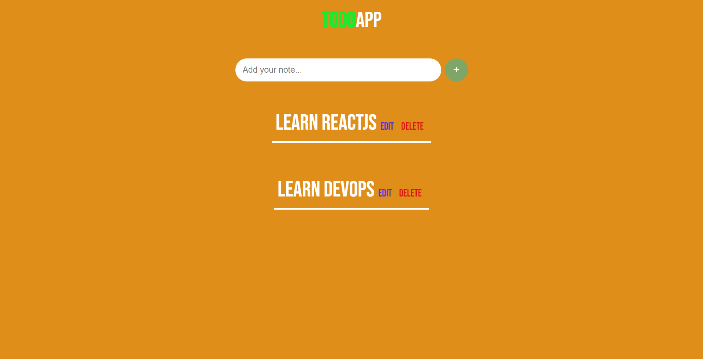

# JavaScript Project - A Simple Todo App

## **Project: TODO APP**

### Concepts learned from this project:
- Created a simple Todo App using DOM manipulation without localstorage.
- This is a practice project mainly to play with DOM Elements.

**Live Link :** [Deployed Link](https://js-project-todoapp.netlify.app/)
>### Preview :

